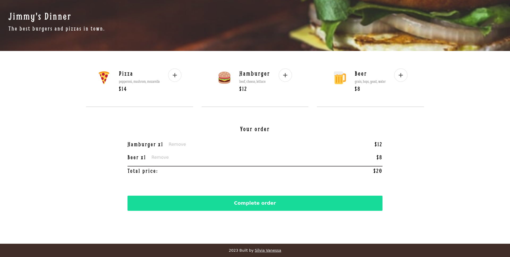
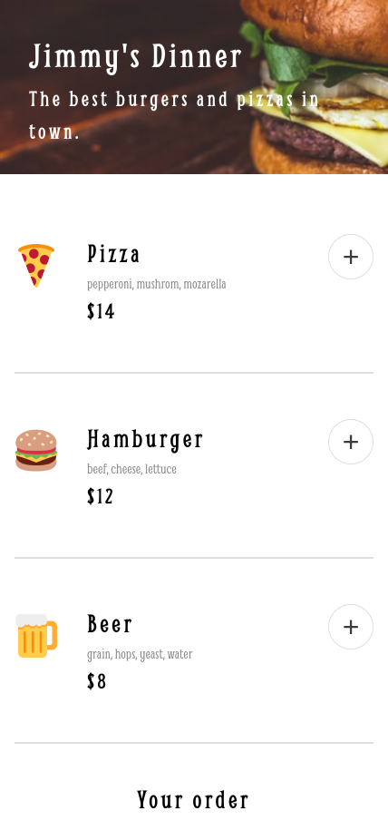
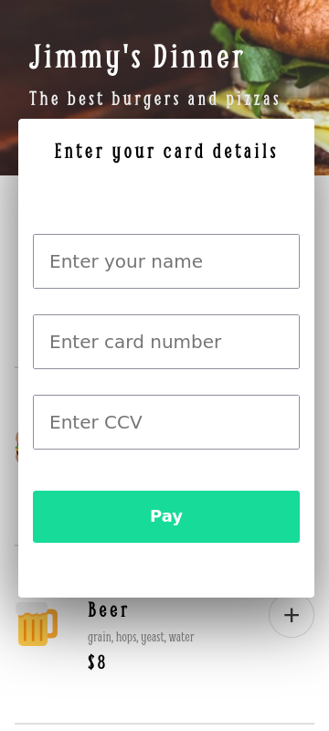
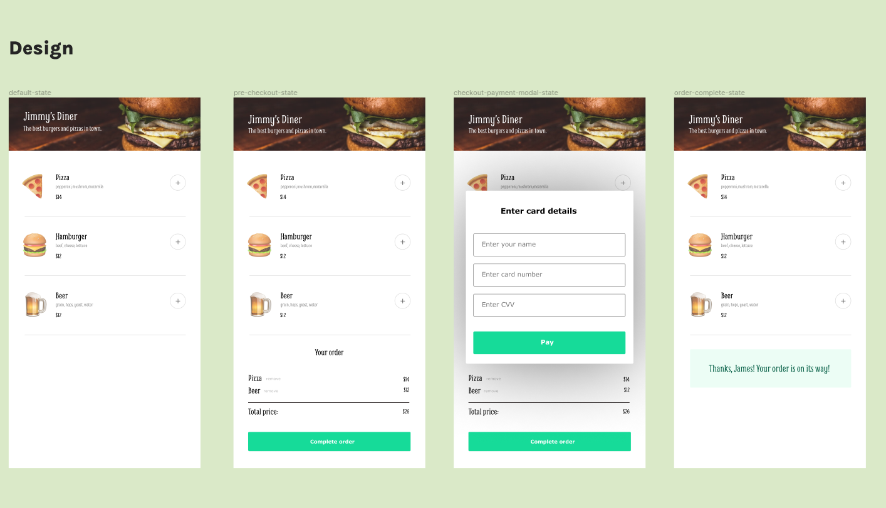

# Ordering Menu

## Overview:

This is a solo project to practice some essential javascript concepts. The design spec was provided by Scrimba.

[](https://app.netlify.com/sites/ordering-func/deploys)

Live preview [Click Here](https://ordering-func.netlify.app/).

## Screenshots







## Quick start:

```
$ npm install
$ npm start
```

## Requirements

- Follow the design spec (Figma file)
- Render the three menu options using Javascript
- Be able to add/remove items
- Have a payment modal with compulsory form inputs

## Design provided



## Stretch goals (optional)

- [ ] Offer a "meal deal" discount
- [ ] Allow users to rate their experience
